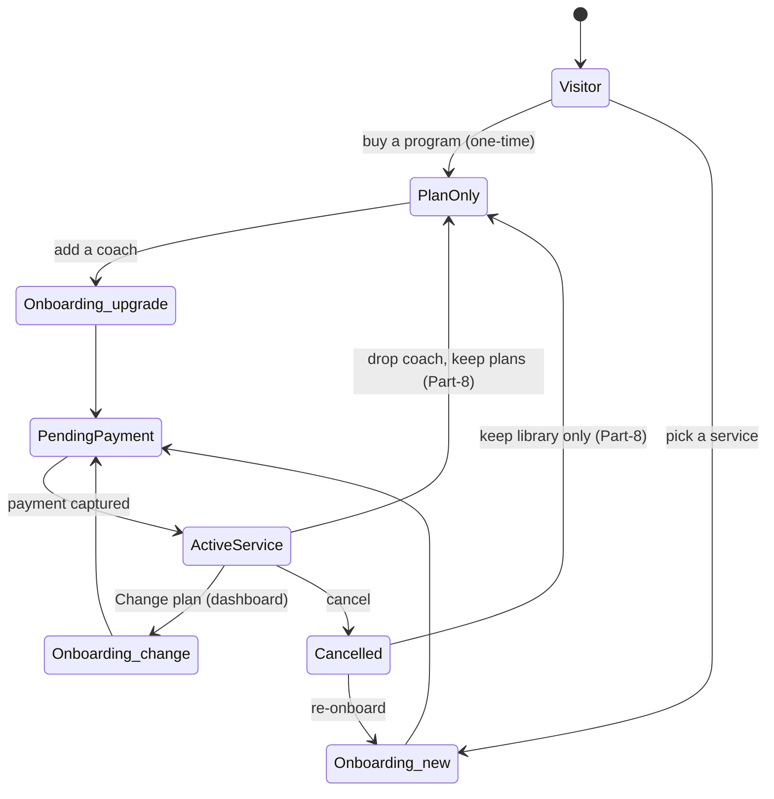

# Onboarding & service-lifecycle flow map

**Status:** Discovery + proposed flows (2026-07-07, Cowork). Companion to `docs/ONBOARDING_REDESIGN_MOCKUPS.html`. Grounds the redesign in what exists today vs what must be designed.

## 1. Per-service onboarding — what each service actually asks

Shared (all services): first/last name, email (locked), phone, DOB, gender, height, "how did you hear", legal (5 agreements), PAR-Q (7 yes/no + injury notes). Discord field is present but **should be removed** (Discord is OUT).

| Service | Step-2 "details" fields | Focus areas | Coach step | Team step |
|---|---|---|---|---|
| **Team Plan** / Fe Squad | `accepts_team_program`, `understands_no_nutrition` (checkboxes) | — | no | **yes** (`TeamSelectionSection` — pick a team) |
| **Bunz of Steel** | + `accepts_lower_body_only` | — | no | yes |
| **1:1 Online** | training_experience, training_goals, training_days_per_week, gym_access_type (+home_gym_equipment if minimal), nutrition_approach | required | yes | no |
| **1:1 Hybrid** / In-Person | training_experience, training_goals, preferred_training_times, preferred_gym_location (+other), nutrition_approach | required | yes | no |

`ServiceSpecificStep.tsx` branches on plan name; `validateStep` (OnboardingForm.tsx) has per-service manual validators. `plan_name` is free to change mid-wizard (the "Change Service" button jumps to step 0; the step array re-derives).

## 2. Subscription state machine (today)

Statuses (`profiles_public.status` / `subscriptions.status`): `pending → {needs_medical_review | pending_coach_approval | pending_payment} → active`, then `active → {suspended | inactive | cancelled | expired}`. `cancelled → pending` and `expired → {pending | active}` allow re-onboard/renew.

Activation is payment-gated: `verify-payment` → `applyCapturedPayment()` flips the sub + profile to `active` (requires a CAPTURED Tap charge — see the `validate_subscription_activation` trigger). Cancel (`cancel-subscription` edge fn) sets `cancelled`/`cancel_at_period_end`, deletes the Tap subscription, records a reason.

## 3. The three gaps

1. **No service-change path (self-serve or admin).** An `active` client is hard-blocked from onboarding (redirect to `/dashboard` with "cancel your current subscription first"). Switching service today = cancel → become `cancelled` → re-onboard from zero, re-answering every question. `AdminBillingManager` has no `service_id` change op.
2. **Cancel orphans the relationships.** Cancelling does NOT clear `coach_client_relationships`, the active nutrition phase, or `client_plan_assignment` rows. They dangle on the old sub; a re-onboard makes a new sub and leaves the old links behind.
3. **Plan-only is unbuilt.** No marketplace tables, no one-time-charge path, no coach-detached account. All of it lives in `PLANS_MARKETPLACE_PLAN.md` (MP1–MP4). So service↔plan-only is greenfield — design for it, wire later.

## 4. Recommended flows (proposed)

The wizard should become **mode-aware**: `new` (today), `change` (existing client switching service), `upgrade` (plan-only → coached). Reuse the same steps, skip what's already known.

### A. Service → Service change  ("Change plan")
- Entry from **dashboard / billing**, not the public Services page. New route/mode, not the blocked public `/onboarding`.
- Pre-fill everything already known (identity, DOB/demographics, PAR-Q, legal-on-file). Only re-collect: **service-specific details** for the new service (e.g. moving Online→Hybrid needs `preferred_training_times` + `preferred_gym_location`), and **re-confirm/keep coach** (keep current coach if they offer the new service and have capacity; otherwise re-pick).
- Show a **price delta** + effective date (proration or next-cycle switch — a billing decision). Confirm before charging.
- Preserve history: keep nutrition phase + program library; don't orphan. Move the coach/nutrition/program links to the new sub (fixes gap #2 for this path).
- **Recommendation:** ship it **admin-assisted first** (pricing, coach capacity, proration are involved), self-serve later. Even admin-assisted needs the link-migration + a "change" onboarding mode.

### B. Service ↔ Plan-only  (gated on marketplace + the Part-8 account-model decision)
- **Plan-only → Service (upgrade):** buyer already has an account + a plan library. Adding a coaching service runs the normal 1:1/team onboarding but **skips account creation** and **keeps the library**. This is the natural upsell.
- **Service → Plan-only (downgrade / pause):** an active client stops coaching but keeps a **coach-detached** account that retains their purchased/assigned plans read-only. Requires the "account decoupled from coach" model (`PLANS_MARKETPLACE_PLAN.md` Part 8 — not yet decided). Good churn-saver: instead of full cancel, offer "keep your plans, drop the coach".

## 5. State diagram

## 6. Implications for the redesign
- The wizard gets a **mode** (`new | change | upgrade`) that controls which steps show and what's pre-filled — a small extension of the plan-derived step array already in place.
- A **service-change entry** on dashboard/billing (even if it opens an admin-assisted request first).
- **Link-migration helper** (move coach/nutrition/program links from old→new sub) — fixes the orphan gap and is reusable by both change and cancel-cleanup.
- Design the **plan-only ↔ service** upsell/downgrade screens now (in the mockup) so the account model is coherent when the marketplace lands; don't build the wiring until MP + Part-8 are decided.
